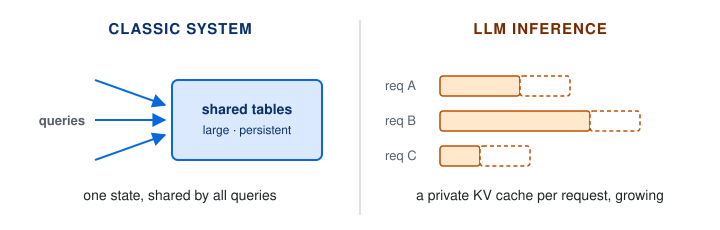

A crash course on LLM inference usually starts with the distinction between prefill and decode: prefill is compute-bound, decode is memory-bound. The distinction is real, but it is a symptom rather than a cause. It also leaves out much of what makes inference hard: the size of the program, the shape of its state, and the traffic between machines. Large models must be spread across machines that talk to each other on every token.

The most useful lens I have found for understanding these gaps comes from [Professor Nir Shavit's](https://people.csail.mit.edu/shanir/) lecture on LLM inference, in which he compares and contrasts the inference engine with an operating system. The two are similar in role: both act as a layer that abstracts hardware complexity away from software developers. Where the comparison breaks, it exposes the nuances about the inference workload.

This post uses that comparison and contrast to understand the "inference problem": what its constraints are, why they make it hard, and what it means for product and business.

## 1. The Inference Engine as an Operating System

An operating system is an abstraction layer. A hardware vendor writes a driver without knowing which database will run on it, and the database team writes code without knowing which CPU sits underneath. That separation is valuable enough to be a business in its own right, which is how companies like Red Hat make money.

An inference engine such as vLLM, SGLang or TensorRT-LLM occupies a similar position in the AI stack. It sits between models and accelerators, so a model author does not need to write kernels for every new chip, and a chip vendor does not need to hand-tune every new model.

The inference engine also relies on the same four mechanisms as an OS:

| Mechanism | The OS manages | The inference engine manages |
|---|---|---|
| Scheduling | processes, threads | requests, tokens |
| Virtual memory | pages in RAM | KV cache blocks in HBM |
| Resource allocation | CPU, memory | GPU memory, compute, network |
| Caching | page cache, buffer cache | KV cache, prefix cache |

Many of the algorithms carry over too. For example, vLLM's PagedAttention is virtual-memory paging applied to the KV cache ([Kwon et al., 2023](https://arxiv.org/abs/2309.06180)). What differs between the OS and the inference engine is the unit these mechanisms manage.

That unit is the **token**. An OS manages processes: long-lived jobs whose demands on CPU and memory stay roughly stable. An inference engine manages requests, but measures work in tokens: prefix caches are keyed on token sequences, and prices and latency are quoted per token. Unlike a process's demands, a request's demands change with every token it generates.

Because the workloads differ, the OS toolbox cannot be reused as is. Each OS algorithm was designed around assumptions about the OS workload. Scheduling assumes switching between jobs is cheap. Paging assumes a process touches only a small working set at a time. Resource allocation assumes a job fits on one machine and gets a share of it. Caching assumes recently used data will be used again and fits close to the processor. Whether a tool still works for inference depends on whether its assumptions still hold, so we first need to understand the inference workload.

## 2. Three Differences from the OS Workload

Compared with LLM inference, operating systems and the workloads they handle have not changed much. CPUs got faster and wider; databases kept the same tables, queries and transactions. So the assumptions behind OS mechanisms still hold for most software: the program is small, the data streams through it, and the state is shared. LLM inference differs on all three.

### 2.1 Huge Program, Small Input

In classic software, a small program runs over large data. If we treat a model's weights as the program and the prompt as its input, the ratio flips by many orders of magnitude:

| Use case | Program → input | Program ÷ input |
|---|---|---|
| Bank totaling monthly statements | PostgreSQL (~10 MB) → 100 GB table | ~10⁻⁴× |
| App counting a year of DAU | Spark job (~100s of MB) → 1 TB of logs | ~10⁻⁴–10⁻³× |
| Store writing alt text for a photo | Qwen3-VL-30B-A3B, MoE (~60 GB) → ~1 MB image | ~60,000× |
| Student solving a math problem | Llama 3.1 70B (~140 GB) → ~100-token prompt | ~350 million× |

*Program size in parentheses; model weights in BF16; text at about 4 bytes per token. The mixture-of-experts (MoE) model counts all parameters, since every expert must stay in memory, though only ~3B are active per token.*

The bottom two rows make the point. In inference workloads, the program is much larger than its input, the reverse of the classic case. This matters for the economics of scaling LLM usage. In a classic *input-driven* program, cost is a function of input size, and that is what systems engineers optimize around. In a *parameter-driven* program like an LLM, the cost of each token is set by the size of the program itself. A model of this size cannot stay resident in any cache, and the largest models do not fit on a single accelerator, so they have to be sharded.

### 2.2 The Program Moves, Not the Data

"Program" and "data" need precise meanings here. In classic data processing, the program is the code and the data is the input records. The code is small and stays close to the processor, in its instruction cache. The records stream from disk or memory through the code, and each is touched once or a few times. When a database scans a table, almost every byte that moves is data.

In LLM inference, the program is the model weights and the data is the current token's hidden state. For Llama 3.1 70B, that is about 140 GB of weights, sharded across GPUs with tensor parallelism, against one 1 × 8,192 vector of about 16 KB. Every decode step reads all the weights from HBM: about ten million bytes of program per byte of data for a single request. MoE models soften this only partly: each token reads the experts it is routed to, but across a batch most experts get read anyway. The data barely moves; the program streams through the processor.

### 2.3 Private, Growing State

A database's state is large, persistent and **shared**; every query reads from the same tables. An LLM request's state is its KV cache. It is **private** to one request, it **grows** with every token, and every decode step **reads all of it and appends to it**.

The engine therefore manages two memory objects with very different properties:

| | Model weights | KV cache |
|---|---|---|
| Size | huge, fixed, known | grows per token, final size unknown |
| Sharing | shared by all requests | private to one request |
| Lifetime | while the model is loaded | the request (longer if cached) |

The three differences build on each other. The program is huge (2.1), so it cannot stay near the processor. Decoding therefore streams it through the processor on every token (2.2). Each request then adds its own growing state (2.3), which competes for the same memory. Together they make memory, not compute, the scarce resource.

## 3. Two Consequences of the Differences

### 3.1 Locality of Reference, Relocated

Locality of reference is the principle that programs tend to reuse data they used recently (temporal locality) and data stored near it (spatial locality). Caches exist because of it, and so does the distributed-systems rule to move computation to the data. In LLM inference, locality loses much of its traditional role, but it does not disappear. It moves, and each difference from Section 2 moves it somewhere specific.

**A. Across machines, locality fails.** A database query moves to the one shard that holds its data. A token must visit every shard of a model too large for one accelerator, and the shards exchange results at every layer (all-to-all between experts in MoE models). Communication therefore sits on the critical path of every token, which is why interconnects such as NVLink and rack-scale systems such as NVL72 are now part of the inference runtime.

**B. Inside the chip, locality matters more.** Every token reuses all of the weights, but 140 GB cannot fit in the 126 MB of L2 cache on a Blackwell GPU ([NVIDIA, 2026a](https://docs.nvidia.com/cuda/blackwell-tuning-guide)). Each pass therefore streams them from HBM. Kernels recover locality one level down: FlashAttention tiles attention so its working set stays in on-chip SRAM ([Dao et al., 2022](https://arxiv.org/abs/2205.14135)), and kernel fusion keeps intermediate results on chip between operations.

**C. Across requests, locality returns.** A request's KV cache is private, yet many requests share a prefix: a system prompt, the earlier turns of a conversation, or the context an agent resubmits at every step. Prefix caching, such as SGLang's RadixAttention ([Zheng et al., 2024](https://arxiv.org/abs/2312.07104)), keeps the KV cache of shared prefixes to avoid recomputation. In agentic workloads, most of each request is a resubmitted prefix.

### 3.2 Idle Compute, Scarce Memory

In the introduction, I called the prefill/decode distinction a symptom. With the three differences in hand, we can trace it to its cause.

Today's mainstream hardware is not purpose-built for LLM inference: the GPU was shaped by graphics and ML training, workloads that perform many operations on every byte they fetch from memory. Whether inference keeps that compute busy depends on how much data each pass of the program serves:

- **Prefill** processes the whole prompt in one pass, so each weight read serves every prompt token. It is **compute-bound**.
- **Decode** generates one token per pass, so each weight read serves a single vector and the compute waits on memory. It is **memory-bandwidth-bound**, and reasoning models make it a growing share of the work.

A single request cannot saturate GPU compute in a decode pass, because each token depends on the one before it (speculative decoding aside). The inference engine therefore batches requests, so that one weight read produces many output tokens. But batching shares the weights, not the KV cache. Each request's attention still reads its own cache, so attention stays memory-bound at any batch size. And every cache grows in the same HBM as the weights, so memory runs out before the batch is large enough to saturate compute.

Decode thus leaves compute idle while memory runs short; that, more than the prefill/decode difference itself, is the core inefficiency. Much of a modern inference engine works around it, with techniques such as weight quantization, grouped-query attention ([Ainslie et al., 2023](https://arxiv.org/abs/2305.13245)), speculative decoding ([Leviathan et al., 2023](https://arxiv.org/abs/2211.17192)), continuous batching ([Yu et al., 2022](https://www.usenix.org/conference/osdi22/presentation/yu)), paged KV cache ([Kwon et al., 2023](https://arxiv.org/abs/2309.06180)) and prefill/decode disaggregation ([Zhong et al., 2024](https://arxiv.org/abs/2401.09670)).

## 4. Defining the Inference Problem

Taken together, the three differences give a precise definition of the inference problem:

> **LLM inference is the problem of streaming a huge program through limited memory, once per token, for many requests whose private state keeps growing.**

Each part of that sentence is a constraint:

- **A huge program.** The weights are too large to stay near the compute, and the largest models must be sharded across GPUs, often across machines, that communicate on every token.
- **Streamed once per token.** Every decode step rereads the weights, so memory bandwidth, not arithmetic, sets the cost per token.
- **Many requests.** Sharing one weight read across requests is the main way to recover efficiency.
- **Private, growing state.** Each request's KV cache grows to a size nobody knows in advance and competes with the weights for the same memory, which caps how many requests can share one weight read.

This closes the loop on Section 1, where each OS mechanism rested on an assumption about the OS workload. The inference workload breaks each assumption and leaves a problem to solve:

- **Scheduling** assumes switching jobs is cheap. In inference, pausing a request means KV cache movement or recomputation. The problem: when to pause a request, and which one.
- **Virtual memory** assumes a process uses a small part of its memory at a time. In inference, every decode step reads a request's entire KV cache. The problem: how to fit as many KV caches as possible into GPU memory.
- **Resource allocation** assumes a job fits on one machine and gets a share of it. In inference, one model spans many GPUs, which exchange results at every layer of every token. The problem: how to split a model across GPUs.
- **Caching** assumes recently used data fits close to the processor. In inference, the most reusable data is the KV cache of shared prompts, and it outgrows GPU memory. The problem: where to keep it, and for how long.

One more difference makes the inference engine's job harder than the OS's. Accelerators (GPUs, TPUs) change every one to two years, the dominant workload changes faster (from chat to tool use, reasoning, agents and video), and new models arrive almost every quarter. Today's inference engine is therefore an **adaptation layer**, not just an abstraction layer.

## 5. Product and Business Implications

**Scale wins on cost.** Because one weight read serves a whole batch, cost per token falls with sustained concurrency. Operators with large, steady traffic keep batches full; small or bursty operators pay for the same weight reads spread over fewer tokens, while compute sits idle. This favors large model providers (e.g., OpenAI, Anthropic and Google) and shared serving platforms (e.g., Together AI and Fireworks AI) over dedicated per-application deployments.

**Batch size is a product dial.** A bigger batch lowers the cost per token but makes each request wait longer for its next token, so latency and cost trade off on the same hardware. Pricing tiers expose this trade-off: discounted batch APIs for work that can wait, and priority or fast tiers for work that cannot. Some providers also charge more per token for very long prompts, for a related reason: a larger KV cache leaves room for fewer requests in each batch.

**Hardware is splitting by phase, and within decode.** Prefill wants compute; decode wants memory bandwidth. Disaggregated serving ([llm-d](https://github.com/llm-d/llm-d), [NVIDIA Dynamo](https://github.com/ai-dynamo/dynamo)) already runs the two phases on separate hardware. NVIDIA's Vera Rubin platform now splits decode itself. Rubin GPUs keep attention over each request's KV cache in HBM, while Groq 3 LPX accelerators, each chip with 500 MB of on-chip SRAM, run the feed-forward layers ([NVIDIA, 2026b](https://developer.nvidia.com/blog/inside-nvidia-groq-3-lpx-the-low-latency-inference-accelerator-for-the-nvidia-vera-rubin-platform)). These, along with SRAM-heavy chips such as Cerebras's, all point the same way: the right mix of chips for a workload matters more than a single "best inference chip".

**State is becoming a product.** Prefix caching already shows up in pricing: several API providers charge much less for cached input tokens than for uncached ones. As agents make context reuse the norm, managing KV state becomes a competitive capability, and systems such as [LMCache](https://github.com/LMCache/LMCache) treat it as data to store and move. Hardware vendors are following: NVIDIA's CMX platform adds a flash storage tier for KV cache between GPU memory and shared storage ([NVIDIA, 2026c](https://developer.nvidia.com/blog/introducing-nvidia-bluefield-4-powered-inference-context-memory-storage-platform-for-the-next-frontier-of-ai/)).

## 6. Open Questions

The third difference looks the least permanent. KV state used to be private and short-lived, but prefix caching, long conversations and agent loops are making it longer-lived, shared and stored across machines, much like database state. That leaves two questions I am still thinking about:

- **Is the inference engine becoming more like a database than an OS?** If managing persistent, shared context becomes the dominant cost, storage and databases may be the more relevant design tradition.
- **Who owns the state?** If a long-running agent's KV cache is the most valuable thing in the system, it matters whether it lives with the model provider, the serving platform or the application.

## References

- Ainslie, J., Lee-Thorp, J., de Jong, M., et al. (2023). [GQA: Training Generalized Multi-Query Transformer Models from Multi-Head Checkpoints](https://arxiv.org/abs/2305.13245). EMNLP 2023.
- Dao, T., Fu, D. Y., Ermon, S., Rudra, A., & Ré, C. (2022). [FlashAttention: Fast and Memory-Efficient Exact Attention with IO-Awareness](https://arxiv.org/abs/2205.14135). NeurIPS 2022.
- Kwon, W., Li, Z., Zhuang, S., et al. (2023). [Efficient Memory Management for Large Language Model Serving with PagedAttention](https://arxiv.org/abs/2309.06180). SOSP 2023.
- Leviathan, Y., Kalman, M., & Matias, Y. (2023). [Fast Inference from Transformers via Speculative Decoding](https://arxiv.org/abs/2211.17192). ICML 2023.
- NVIDIA. (2026a). [Tuning CUDA Applications for Blackwell GPU Architecture](https://docs.nvidia.com/cuda/blackwell-tuning-guide). CUDA Toolkit Documentation, last updated Sept. 13, 2026.
- NVIDIA. (2026b). [Inside NVIDIA Groq 3 LPX: The Low-Latency Inference Accelerator for the NVIDIA Vera Rubin Platform](https://developer.nvidia.com/blog/inside-nvidia-groq-3-lpx-the-low-latency-inference-accelerator-for-the-nvidia-vera-rubin-platform). NVIDIA Technical Blog, Mar. 16, 2026.
- NVIDIA. (2026c). [Introducing NVIDIA BlueField-4-Powered CMX Context Memory Storage Platform for the Next Frontier of AI](https://developer.nvidia.com/blog/introducing-nvidia-bluefield-4-powered-inference-context-memory-storage-platform-for-the-next-frontier-of-ai/). NVIDIA Technical Blog, Mar. 16, 2026.
- Yu, G.-I., Jeong, J. S., Kim, G.-W., Kim, S., & Chun, B.-G. (2022). [Orca: A Distributed Serving System for Transformer-Based Generative Models](https://www.usenix.org/conference/osdi22/presentation/yu). OSDI 2022.
- Zheng, L., Yin, L., Xie, Z., et al. (2024). [SGLang: Efficient Execution of Structured Language Model Programs](https://arxiv.org/abs/2312.07104). NeurIPS 2024.
- Zhong, Y., Liu, S., Chen, J., et al. (2024). [DistServe: Disaggregating Prefill and Decoding for Goodput-optimized Large Language Model Serving](https://arxiv.org/abs/2401.09670). OSDI 2024.
