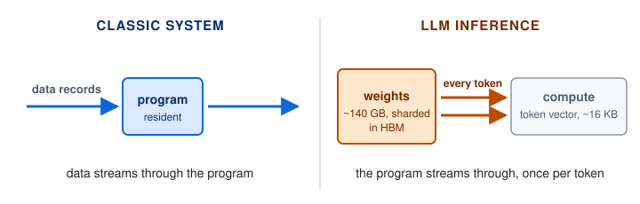

I came to LLM inference through a practical question about GPU utilization while running self-hosted VLM inference. Chasing it led me to serving frameworks such as [SGLang](https://github.com/sgl-project/sglang), and from there deeper into how these systems are built. The further I went, the clearer it became that the techniques only make sense once we understand the workload: what an LLM program reads and writes, how it uses the hardware, and how its demands change over the life of a request.

Many introductions to LLM inference start with the distinction between prefill and decode: prefill is compute-bound, decode is memory-bound. The distinction is real, but it is a symptom rather than a cause. It also leaves out much of what makes inference hard, including the size of the program, the shape of its state, and the fact that large models have to be spread across machines that talk to each other on every token.

The most useful lens I have found for these questions comes from [Professor Nir Shavit's](https://people.csail.mit.edu/shanir/) LLM inference class, in which he compares the inference engine to an operating system. The comparison is helpful because it partly holds: both act as a layer that abstracts hardware complexity away from software developers. Where the comparison breaks, it exposes what is actually new.

This post uses that comparison to understand the "inference problem". Some core ideas here come from Professor Shavit's lecture: the three differences between OS and inference workloads, and the observation about locality of reference. The extensions, connections and analysis, and any errors, are mine.

## 1. The Inference Engine as an Operating System

An operating system is an abstraction layer. It hides the hardware from applications and the applications from the hardware. A hardware vendor writes a driver without knowing which database will run on it, and the database team writes code without knowing which CPU sits underneath. That separation is valuable enough to be a business in its own right, which is a large part of why a company like Red Hat exists.

An inference engine such as vLLM, SGLang or TensorRT-LLM occupies a similar position in the AI stack. It sits between models and accelerators, so a model author does not need to write kernels for every new chip, and a chip vendor does not need to hand-tune every new model.

The inference engine also draws on the same four mechanisms an OS does:

| Mechanism | The OS manages | The inference engine manages |
|---|---|---|
| Scheduling | processes, threads | requests, tokens |
| Virtual memory | pages in RAM | KV-cache blocks in GPU memory (HBM) |
| Resource allocation | CPU, memory | GPU memory, compute, network |
| Caching | page cache, buffer cache | KV cache, prefix cache |

The names carry over, and so do many of the algorithms and techniques. For example, PagedAttention, the core idea behind vLLM, is virtual-memory paging applied to the KV cache ([Kwon et al., 2023](https://arxiv.org/abs/2309.06180)). In this sense, the inference engine uses an algorithmic toolbox similar to an OS's, with a different unit of management.

The new unit is the **token**. In an OS, work is organized around the process: the scheduler hands out CPU time to processes, and memory is managed in pages that belong to them. A process is long-lived, and its demands on CPU and memory are roughly stable over its lifetime. In an inference engine, the request plays the role of the process, but almost everything is measured and managed in tokens. A request advances one token per step. At every step, the scheduler decides which requests get to process how many tokens, within a per-step token budget. The KV cache grows by a fixed amount per token and is allocated in blocks of a fixed number of tokens (16 by default in vLLM). Prefix caches are keyed on token sequences, and cost and latency are both quoted per token. Unlike a process, a request's demands change with every token it produces.

A mechanism, however, is more than its algorithm. Each one was designed around assumptions about the workload it serves. Scheduling assumes that switching from one job to another is cheap. Paging assumes a process touches only a small working set of its memory at a time. Caching assumes that recently used data will be used again soon, and that it fits somewhere close by. Whether a tool still works after the unit of management changes depends on whether those assumptions survive the change. To find out, we first need to understand the workload itself.

## 2. Understanding the Inference Workload Through Its Differences from the OS

The core ideas of operating systems have changed little in decades, largely because the systems around them have been stable. CPUs became faster and wider, and databases kept the same model of tables, queries and transactions. As a result, the assumptions made when these mechanisms were first designed still hold for most software today: the program is small, the input can be large, and the data is shared. The LLM inference workload differs from this picture in three ways.

### 2.1 Huge Program, Small Input

In classic software, a small program runs over large data. If we treat a model's weights as the program and the prompt as its input, the ratio flips by many orders of magnitude:

| Workload | Program | Input | Program ÷ input |
|---|---|---|---|
| PostgreSQL scanning a 100 GB table (a bank totaling a month of transactions for statements) | server binary, ~10 MB | 100 GB | ~10⁻⁴× |
| Spark job over a 1 TB log archive (an app counting DAU from a year of logs) | runtime and job code, a few hundred MB | 1 TB | ~10⁻⁴–10⁻³× |
| Qwen2.5-VL-7B captioning one photo (write alt text for a product image) | ~16 GB of weights (BF16) | ~1 MB image | ~16,000× |
| Llama 3.1 70B answering a ~100-token prompt (solve one middle-school math problem) | ~140 GB (BF16) | ~400 B of text | ~350 million× |

*Approximate sizes; text assumes about 4 bytes per token.*

The bottom two rows make the point. Across these workloads, the program is thousands to hundreds of millions of times larger than its input, the reverse of the classic case. This matters for the economics of scaling LLM usage. In a classic *input-driven* program, cost is a function of input size, and that is what systems engineers optimize around. In a *parameter-driven* program like an LLM, cost is dominated by the size of the program itself. A model of this size cannot stay resident in any cache, and the largest models do not fit on a single accelerator at all; they have to be spread across many nodes in a cluster.

### 2.2 The Program Moves, Not the Data

"Program" and "data" need precise meanings here. In classic data processing, the program is the code and the data is the input records. The code is small and stays resident close to the processor, in its instruction cache. The records stream from disk or memory through the code, and each is touched once or a few times. When a database scans a table, almost every byte that moves is data.

In LLM decoding, the phase that generates output one token at a time, the program is the model weights. The data at each step is not the prompt or the output text as such, but the working representation of the one token being processed: a vector with one value per hidden dimension (8,192 for a 70B model), about 16 KB in BF16. Generation is autoregressive. Each output token depends on the one before it, so the model runs one full forward pass per token. Because the weights are far too large to stay on chip (an H100 has about 50 MB of L2 cache against 140 GB of weights), every pass reads all the active weights from HBM again. To move a 16 KB vector (the data) forward by one token, the processor reads about 140 GB of model weights (the program), roughly ten million bytes of program for every byte of data. The data barely moves; the program streams through the processor, once per token. Section 3 shows what this pattern does on a GPU.

### 2.3 Private, Growing State

A database's state is large, persistent and **shared**; every query reads from the same tables. An LLM request's state is its KV cache. It is **private** to one request, it **grows** with every token, and every decode step **reads all of it and appends to it**.

The engine therefore manages two memory objects with very different properties:

| | Model weights | KV cache |
|---|---|---|
| Size | huge, fixed, known in advance | grows per token; final size unknown |
| Sharing | shared by every request | private to one request |
| Lifetime | as long as the model is loaded | as long as the request (or longer, if cached) |

The three differences build on each other. The program is huge (2.1), so it cannot stay near the processor. Decoding therefore streams it through the processor on every token (2.2). Each request then adds its own growing state (2.3), which competes for the same memory. Together they make memory, not compute, the scarce resource.

## 3. Two Consequences of the Inference Workload

### 3.1 The GPU Is Built for Prefill, Not Decode

Today's mainstream hardware was not designed for LLM inference. We have the GPU, shaped by graphics and then training, and the transformer, shaped by what trains well; inference engineering is the work of making the two run well together.

How well they fit depends on the phase:

- **Prefill** processes the whole prompt in one pass. It is a large matrix-matrix multiplication in which each weight read from memory is used for every prompt token. This is the workload GPUs are built for, and it is **compute-bound**.
- **Decode** generates one token per pass. It is a matrix-vector multiplication in which each weight read from memory is used once, so the GPU's compute units finish long before the next weights arrive and sit idle. Decode is **memory-bandwidth-bound**, which is not the workload GPUs are built for.

An H100 can perform about 300 operations in the time it reads one byte from HBM; decoding a single request performs about one, leaving over 99% of the compute unused ([Lenovo Press](https://lenovopress.lenovo.com/lp1732.pdf)). A server doing this can still report near-100% GPU utilization, because `nvidia-smi` counts the time any kernel is running, not the compute in use.

Batching helps. Decoding one token for each of 64 requests in the same pass stacks 64 vectors into a matrix, so each weight read serves 64 requests instead of one. This inverts an OS intuition: more processes sharing a CPU means contention, but more requests sharing a GPU makes each token cheaper. Batching does not solve everything, though, because of the KV cache (2.3). Each request's attention still reads its own private cache, which stays memory-bound at any batch size, and every added request needs its own cache in the same HBM as the weights, so memory often runs out before the batch is large enough.

Much of a modern inference engine is a set of techniques for working around these limits:

| Technique | What it works around |
|---|---|
| Continuous batching ([Yu et al., 2022](https://www.usenix.org/conference/osdi22/presentation/yu)) | Keeps the batch full by admitting and retiring requests at every step. |
| Paged KV cache ([Kwon et al., 2023](https://arxiv.org/abs/2309.06180)) | Wasted HBM: earlier systems used only 20–38% of KV memory for actual token state. |
| Weight quantization (FP8, INT4) | Bandwidth: fewer bytes to read per weight. |
| Grouped-query and multi-head latent attention ([Ainslie et al., 2023](https://arxiv.org/abs/2305.13245); [DeepSeek-AI, 2024](https://arxiv.org/abs/2405.04434)) | KV size: a smaller cache per token, so more requests fit. |
| Speculative decoding ([Leviathan et al., 2023](https://arxiv.org/abs/2211.17192)) | One token per pass: the model verifies several drafted tokens at once. |
| Prefill/decode disaggregation ([Zhong et al., 2024](https://arxiv.org/abs/2401.09670); [Patel et al., 2024](https://arxiv.org/abs/2311.18677)) | Opposite bottlenecks: each phase runs on machines suited to it. |

### 3.2 Locality of Reference, Relocated

Locality of reference is the observation that programs tend to reuse data they used recently (temporal locality) and data stored near it (spatial locality). Caches exist because of it, and so does the distributed-systems rule to move computation to the data. In LLM inference, locality loses much of its traditional role, but it does not disappear. It moves, and each difference from Section 2 moves it somewhere specific.

**A. Across machines, locality fails** (2.1). Distributed databases exist because the *data* is too large for one machine; distributed inference exists because the *program* is too large for one accelerator. A database query touches only the shard that holds its data, while every token of a model passes through every shard. Moving computation to the data has nothing to act on, and communication can only be made faster, which is why interconnects such as NVLink and rack-scale systems such as NVL72 are now part of the inference runtime.

**B. Inside the chip, locality matters more than ever** (2.2). The weights look like an ideal case for caching, since every token reuses all of them. But reuse pays off only if the data fits near the processor, and 140 GB of weights do not fit in 50 MB of L2 cache. Because the resulting stream from HBM is the bottleneck, every avoided trip to HBM matters, and locality reappears one level down, inside kernels. FlashAttention tiles attention so its working set stays in on-chip SRAM ([Dao et al., 2022](https://arxiv.org/abs/2205.14135)), and kernel fusion keeps intermediate results on chip between operations.

**C. Across requests, locality returns over time** (2.3). Within a request, the KV cache is private. Across requests, much of it repeats: a shared system prompt, the earlier turns of a conversation, the growing context an agent resubmits at every step. Prefix caching, such as SGLang's RadixAttention ([Zheng et al., 2024](https://arxiv.org/abs/2312.07104)), keeps the KV cache for shared prefixes so later requests skip recomputing them, and agentic workloads make it more valuable.

## 4. Defining the Inference Problem

Put together, the comparison to an OS helps us frame a precise definition of the inference problem:

> **LLM inference is the problem of streaming a huge program through limited memory, once per token, for many requests whose private state keeps growing.**

Each part of that sentence is a constraint:

- **A huge program.** The weights are too large to stay near the compute, and the largest models must be split across machines that communicate on every token.
- **Streamed once per token.** Every output token rereads the weights, so memory bandwidth, not arithmetic, sets the cost per token.
- **Many requests.** Sharing one weight read across requests is the main way to recover efficiency.
- **Private, growing state.** Each request's KV cache grows to a size nobody knows in advance and competes with the weights for the same memory, which caps how many requests can share.

This closes the loop on Section 1, where each OS mechanism rested on an assumption about its workload. The table follows each assumption through the three differences.

| Mechanism | OS assumption | What happens in LLM inference | Problem to solve |
|---|---|---|---|
| Scheduling | Switching jobs is cheap; more jobs means more contention. | Preemption evicts gigabytes of KV cache; more requests make each token cheaper. | How to trade throughput against latency when output lengths are unknown? |
| Virtual memory | A process touches a small working set; paging adds isolation and overcommit. | Every decode step reads the entire KV cache; paging exists because output length is unknown. | How to allocate, share and reclaim KV memory when it sets batch size? |
| Resource allocation | Computation moves to the data. | The program is distributed and communicates on every token; prefill and decode want different hardware. | How to split a model across devices and place the two phases? |
| Caching | Recent data is reused and fits close to the processor. | Weights are reused but do not fit; locality moves into kernels and across requests. | Where should KV state live, for how long, and how should requests be routed to it? |

One more difference makes the inference engine's job harder than the OS's. An OS sits between a stable floor and a stable ceiling; an inference engine has neither. Accelerators (GPUs, TPUs) change every one to two years, the dominant workload changes even faster (from chat to tool use, reasoning, agents and video), and new models arrive almost every quarter. Today's inference engine is therefore an **adaptation layer**, not just an abstraction layer.

## 5. Implications

**Scale wins on cost.** Because one weight read serves a whole batch, cost per token falls with sustained concurrency. Operators with large, steady traffic keep batches full; small or bursty operators pay for idle bandwidth on the same hardware. This favors large providers and shared platforms over dedicated per-application deployments.

**Hardware is splitting by phase.** Prefill wants compute; decode wants memory bandwidth. Disaggregated serving ([llm-d](https://github.com/llm-d/llm-d), [NVIDIA Dynamo](https://github.com/ai-dynamo/dynamo)), SRAM-heavy decode chips (Groq, Cerebras) and NVIDIA's prefill-oriented Rubin CPX, which uses GDDR7 instead of HBM ([The Register, 2025](https://www.theregister.com/2025/09/10/nvidia_rubin_cpx/)), all point the same way: the right mix of chips for a workload matters more than a single "best inference chip".

**State is becoming a product.** Prefix caching already shows up in pricing: several API providers charge much less for cached input tokens than for uncached ones. As agents make context reuse the norm, managing KV state (where it lives, how long it is kept, how requests are routed to it) becomes a competitive capability, and systems such as [LMCache](https://github.com/LMCache/LMCache) treat it as data to store and move.

## 6. Open Questions

The third difference looks the least permanent. KV state used to be private and short-lived, but prefix caching, long conversations and agent loops are making it longer-lived, shared and stored across machines, much like database state. That leaves two questions I am still thinking about:

- **Is the inference engine becoming more like a database than an OS?** If managing persistent, shared context becomes the dominant cost, storage and databases may be the more relevant design tradition.
- **Who owns the state?** If a long-running agent's KV cache is the most valuable thing in the system, it matters whether it lives with the model provider, the serving platform or the application.

## References

- Ainslie, J., Lee-Thorp, J., de Jong, M., et al. (2023). [GQA: Training Generalized Multi-Query Transformer Models from Multi-Head Checkpoints](https://arxiv.org/abs/2305.13245). EMNLP 2023.
- Dao, T., Fu, D. Y., Ermon, S., Rudra, A., & Ré, C. (2022). [FlashAttention: Fast and Memory-Efficient Exact Attention with IO-Awareness](https://arxiv.org/abs/2205.14135). NeurIPS 2022.
- DeepSeek-AI (2024). [DeepSeek-V2: A Strong, Economical, and Efficient Mixture-of-Experts Language Model](https://arxiv.org/abs/2405.04434).
- Kwon, W., Li, Z., Zhuang, S., et al. (2023). [Efficient Memory Management for Large Language Model Serving with PagedAttention](https://arxiv.org/abs/2309.06180). SOSP 2023.
- Leviathan, Y., Kalman, M., & Matias, Y. (2023). [Fast Inference from Transformers via Speculative Decoding](https://arxiv.org/abs/2211.17192). ICML 2023.
- Patel, P., Choukse, E., Zhang, C., et al. (2024). [Splitwise: Efficient Generative LLM Inference Using Phase Splitting](https://arxiv.org/abs/2311.18677). ISCA 2024.
- Yu, G.-I., Jeong, J. S., Kim, G.-W., Kim, S., & Chun, B.-G. (2022). [Orca: A Distributed Serving System for Transformer-Based Generative Models](https://www.usenix.org/conference/osdi22/presentation/yu). OSDI 2022.
- Zheng, L., Yin, L., Xie, Z., et al. (2024). [SGLang: Efficient Execution of Structured Language Model Programs](https://arxiv.org/abs/2312.07104). NeurIPS 2024.
- Zhong, Y., Liu, S., Chen, J., et al. (2024). [DistServe: Disaggregating Prefill and Decoding for Goodput-optimized Large Language Model Serving](https://arxiv.org/abs/2401.09670). OSDI 2024.
- NVIDIA H100 specifications: [Lenovo Press datasheet](https://lenovopress.lenovo.com/lp1732.pdf); [Glenn Lockwood's H100 notes](https://glennklockwood.com/garden/processors/H100).
- Rubin CPX: [The Register](https://www.theregister.com/2025/09/10/nvidia_rubin_cpx/) (Sept. 10, 2025); [Futurum Group](https://futurumgroup.com/insights/nvidias-new-rubin-cpx-targets-future-of-large-scale-inference/).
